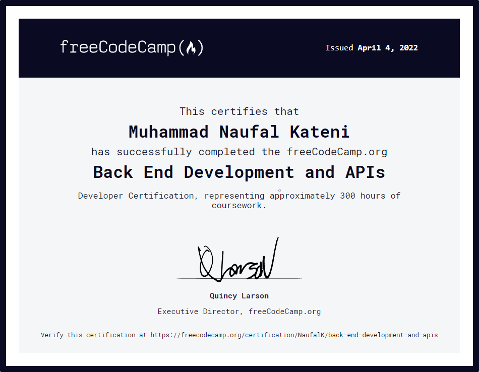

# Back End Development and APIs (freeCodeCamp)

    

### Summary

---

Until this point, you've only used JavaScript on the front end to add interactivity to a page, solve algorithm challenges, or build an SPA. But JavaScript can also be used on the back end, or server, to build entire web applications.

Today, one of the popular ways to build applications is through microservices, which are small, modular applications that work together to form a larger whole.

In the Back End Development and APIs Certification, you'll learn how to write back end apps with Node.js and npm (Node Package Manager). You'll also build web applications with the Express framework, and build a People Finder microservice with MongoDB and the Mongoose library.

[Back End Development and APIs (freeCodeCamp)](https://www.freecodecamp.org/learn/back-end-development-and-apis/)

### Project

---

You've worked with APIs before, but now that you know npm, Node, Express, MongoDB, and Mongoose, it's time to build your own. Draw on everything you've learned up to this point to create 5 different microservices, which are smaller applications that are limited in scope.

After creating these, you'll have 5 cool microservice APIs you can show off to friends, family, and potential employers. Oh, and you'll have a shiny new Back End Development and APIs Certification, too.

1. [Timestamp Microservice](https://www.freecodecamp.org/learn/back-end-development-and-apis/back-end-development-and-apis-projects/timestamp-microservice)
2. [Request Header Parser Microservice](https://www.freecodecamp.org/learn/back-end-development-and-apis/back-end-development-and-apis-projects/request-header-parser-microservice)
3. [URL Shortener Microservice](https://www.freecodecamp.org/learn/back-end-development-and-apis/back-end-development-and-apis-projects/url-shortener-microservice)
4. [Exercise Tracker](https://www.freecodecamp.org/learn/back-end-development-and-apis/back-end-development-and-apis-projects/exercise-tracker)
5. [File Metadata Microservice](https://www.freecodecamp.org/learn/back-end-development-and-apis/back-end-development-and-apis-projects/file-metadata-microservice)

### Certificate

---

    <a href="https://www.freecodecamp.org/certification/NaufalK/back-end-development-and-apis">
        Back End Development and APIs
    </a>

